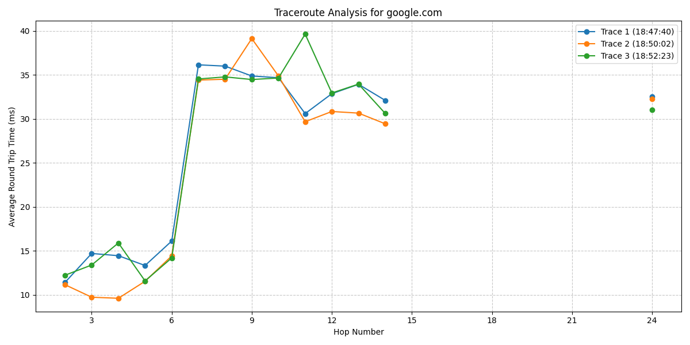

# The Amazing Trace

## Description
This tool is designed to execute the traceroute command from linux and parse the data to make it easier to comprehend and visualize the traceroute data to analyse network latency and routing paths.

## Why Use This Tool?
Traceroute is essential for diagnosing network issues, such as slow connections or unreachable hosts. This tool makes it easier to visualize and understand the information from the `traceroute` command.

## Features

- Executes multiple traceroutes to a destination.
- Parses standard Unix traceroute output into a structured format.
- Handles timeouts and alternative output formats.
- Visualizes the average RTT for each hop with a line plot.
- Saves the plot as an image file in the specified output directory.

## Dependencies 

*You will also need these modules to run the tool*
- `matplotlib` – for visualizing traceroute data.
- `pandas` – for handling and processing the data.
- `numpy` – for numerical operations, such as calculating averages.
- `re` (regular expressions) – part of the standard Python library, used to parse the traceroute output.

You can install the required modules by running the following command in bash:

`pip install matplotlib pandas numpy`

This script works on Linux and macOS natively since they are made to run the `traceroute` command. However, for the most consistent development environment across platforms, **Vagrant** with a virtual machine that runs a Linux distribution would be your best option.

## How to run it

To run the tool all you need to do is place `python3` or `python` infront of the path to the file, 
e.g. `python3 amazing_trace.py`. Then all you need to do is look in the output folder and you will see all the data from running the file on a nice line graph.

## Example Usage

*Running the tool in the terminal.*

*Results from running the exectuable in the terminal on a line graph.*